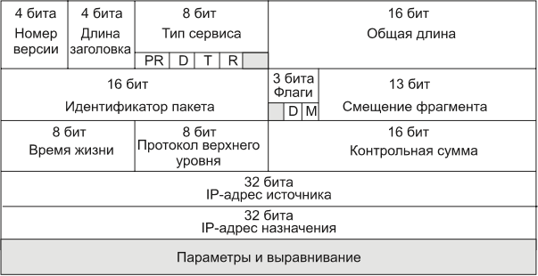

# Экзамен по сетям

---

## IP пакет, структура IP пакета

Протокол IP относится к протоколам _без установления соединений_, поддерживая обработку
каждого IP-пакета как независимой единицы обмена, не связанной с другими пакетами.
В протоколе IP нет механизмов, обычно применяемых для обеспечения достоверности
конечных данных. Если во время продвижения пакета происходит какая-либо ошибка, то
протокол IP по своей инициативе ничего не предпринимает для ее исправления. Протокол IP реализует политику доставки «по
возможности».

### Структура IP пакета:

* `Номер версии` занимает 4 бита и идентифицирует версию протокола IP. (IPv4, IPv6)
* `Длина заголовка` занимает 4 бита и и измеряется в 32-битных
  словах. Обычно заголовок имеет длину в 20 байт (пять 32-битных слов), но при добавлении некоторой служебной информации
  это значение может быть увеличено за счет дополнительных байтов в поле параметров. Наибольшая длина заголовка
  составляет 60 байт.
* `Тип сервиса (Type of Service, ToS)` имеет и другое, более современное название —
  `байт дифференцированного обслуживания`, или` DS-байт`. Поле служит для хранения признаков, отражающих требования к
  качеству обслуживания пакета.
    * В прежнем варианте первые три бита содержат значение приоритета пакета: от самого
      низкого — 0 до самого высокого — 7. Маршрутизаторы и компьютеры могут принимать
      во внимание приоритет пакета и обрабатывать более важные пакеты в первую очередь.
    * Следующие три бита поля `ToS` определяют критерий выбора маршрута. Если для бита `D
      (Delay — задержка)` установлено значение 1, то маршрут должен выбираться для минимизации задержки доставки данного
      пакета.
    * Установленный бит `T (Throughput — пропускная
      способность)` — для максимизации пропускной способности
    * Бит `R (Reliability — надежность)` — для максимизации
      надежности доставки. Оставшиеся два бита имеют нулевое
      значение.

    * Стандарты дифференцированного обслуживания, принятые в конце 90-х, дали новое название этому полю, переопределив
      назначение его битов. В `DS-байте` также используются только старшие 6 бит, а два младших бита резервируются.
      `Об этом лучше не упоминать, тк вопроса про DS байты нет в экзамене`
* `Общая длина (2 байта)` - характеризует общую длину пакета с учетом заголовка и поля данных. Максимальная длина пакета
  ограничена разрядностью поля, определяющего эту величину, и составляет 65 535 байт, но в большинстве компьютеров и
  сетей столь большие пакеты не используются. _При передаче по сетям различного типа
  длина пакета выбирается с учетом максимальной длины пакета протокола нижнего уровня, несущего IP-пакеты._ `В стандартах TCP/IP
  предусматривается, что все хосты должны быть готовы принимать пакеты длиной вплоть
  до 576 байт (независимо от того, приходят они целиком или фрагментами).`
* `Идентификатор пакета (2 байта)` - используется для распознавания пакетов,
  образовавшихся путем деления на части (фрагментации) исходного пакета. Все части
  (фрагменты) одного пакета должны иметь одинаковое значение этого поля.
* `Флаги (3 байта)` - содержат признаки, связанные с фрагментацией.
    * `бит DF (Do not Fragment — не фрагментировать)` запрещает маршрутизатору
      фрагментировать данный пакет,
    * `бит MF (More Fragments — больше фрагментов)` говорит о том, что данный пакет является промежуточным (не
      последним)
      фрагментом.
    * Оставшийся бит зарезервирован.
* `Смещения фрагмента (13 бит)` задает смещение в байтах поля данных этого
  фрагмента относительно начала поля данных исходного (нефрагментированного) пакета. `Используется при сборке/разборке
  фрагментов пакетов. Смещение должно быть кратно 8 байтам.`
* `Время жизни (1 байт)` используется для задания
  предельного срока, в течение которого пакет может перемещаться по сети. Время жизни
  пакета измеряется в секундах и задается источником. Поскольку современные
  маршрутизаторы редко обрабатывают пакет дольше, чем за одну секунду, то время жизни
  можно интерпретировать как `максимальное число транзитных узлов`, которые разрешено
  пройти пакету. Если значение поля времени жизни становится нулевым до того, как пакет
  достигает получателя, то пакет уничтожается. `Таким образом, время жизни является своего
  рода часовым механизмом самоуничтожения пакета.`
* `Протокол верхнего уровная(1 байт)` одержит идентификатор, указывающий, какому протоколу верхнего уровня принадлежит
  информация, размещенная
  в поле данных пакета. Например, 6 означает, что
  в пакете находится сообщение протокола TCP, 17 — протокола UDP, 1 — протокола ICMP.

| **Значение** | **Протокол**                                       | **Описание**                                     |
  |--------------|----------------------------------------------------|--------------------------------------------------|
| 0            | Зарезервировано                                    | Используется для специальных целей.              |
| 1            | ICMP (Internet Control Message Protocol)           | Протокол управления сообщениями.                 |
| 2            | IGMP (Internet Group Management Protocol)          | Протокол управления группами.                    |
| 3            | GGP (Gateway-to-Gateway Protocol)                  | Протокол маршрутизации между шлюзами.            |
| 4            | IPv4 (encapsulation)                               | Инкапсуляция IPv4 в IPv4.                        |
| 5            | ST (Stream Protocol)                               | Протокол потоковой передачи.                     |
| 6            | TCP (Transmission Control Protocol)                | Надежный протокол передачи данных.               |
| 8            | EGP (Exterior Gateway Protocol)                    | Протокол внешнего шлюза.                         |
| 9            | IGP (Interior Gateway Protocol)                    | Протокол внутреннего шлюза.                      |
| 17           | UDP (User Datagram Protocol)                       | Ненадежный протокол передачи данных.             |
| 27           | RDP (Reliable Data Protocol)                       | Надежный протокол передачи данных.               |
| 41           | IPv6 (encapsulation)                               | Инкапсуляция IPv6 в IPv4.                        |
| 47           | GRE (Generic Routing Encapsulation)                | Протокол туннелирования.                         |
| 50           | ESP (Encapsulating Security Payload)               | Протокол обеспечения конфиденциальности (IPsec). |
| 51           | AH (Authentication Header)                         | Протокол аутентификации (IPsec).                 |
| 88           | EIGRP (Enhanced Interior Gateway Routing Protocol) | Улучшенный протокол маршрутизации.               |
| 89           | OSPF (Open Shortest Path First)                    | Протокол маршрутизации.                          |
| 115          | L2TP (Layer Two Tunneling Protocol)                | Протокол туннелирования уровня 2.                |
| 132          | SCTP (Stream Control Transmission Protocol)        | Протокол передачи сообщений.                     |
| 255          | Зарезервировано                                    | Для будущего использования.                      |

* `Контрольная сумма заголовка (2 байта)` рассчитывается только по заголовку. Поскольку некоторые поля заголовка меняют
  свое значение в процессе передачи
  пакета по сети (например, поле времени жизни), контрольная сумма проверяется и повторно рассчитывается на каждом
  маршрутизаторе и конечном узле как дополнение к сумме
  всех 16-битных слов заголовка. При вычислении контрольной суммы значение самого поля
  контрольной суммы устанавливается в ноль. Если контрольная сумма неверна, то пакет
  отбрасывается, как только обнаруживается ошибка.
* `Поля IP-адресов источника и приемника имеют одинаковую длину — 32 бита.`
* `Поле параметров является необязательным и используется обычно только при отладке
  сети.` Это поле состоит из нескольких подполей одного из восьми предопределенных типов. В этих подполях можно
  указывать точный маршрут, по которому маршрутизаторы
  должны направлять данный пакет (то есть выполнять `маршрутизацию от источника`),
  регистрировать проходимые пакетом маршрутизаторы или помещать данные системы
  безопасности и временные отметки. Так как число подполей в поле параметров может быть
  произвольным, то в конце заголовка должно быть добавлено несколько нулевых байтов
  для выравнивания заголовка пакета по 32-битной границе.

### Функции IP:

* _Поддержание интерфейса с нижележащими технологиями_ подсетей является одной из важнейших функций протокола IP. В эти
  функции входит
  также _поддержание интерфейса с протоколами вышележащего транспортного уровня_, в частности с протоколом TCP, который
  решает все вопросы обеспечения надежной доставки данных по составной сети в стеке TCP/IP.
* Большая часть действий протокола связана с обработкой той служебной информации, которая переносится в полях заголовка пакета.

## IP маршрутизация, упрощённая таблица маршрутизации, таблица маршрутизации конечного хоста

## IP маршрутизация: без масок, на основе масок

## Схема протоколов модели OSI

## Протокол ICMP, структура кадра, типы сообщений, коды ошибок

## Протоколы TCP/UDP мультиплексировени и демультиплексирование, сокеты

## Протокол UDP, структура кадра

## Протокол TCP, структура кадра, схема логического содеинения в TCP

## Протокол TCP, схма состояний

## Классификация протоколов маршрутизации

## Протокол RIP, время жизни пакетов, зацикливание пакетов

## Протокол BGP

## Общие принципы построения служб

## URI, URL, URN

## Протокол HTTP, веб-клиент, веб-сервер, заголовки, cookie

## Протоколы TLS, SSL

## Протокол FTP

## Почтовая служба, протоколы POP и IMAP

## Протокол DNS

## Протоколы IPv5 и IPv6. Стркуктрура даресов IPv6

## Формат пакета IPv6

## Архитектура безпроводных сетей

## Стек протоколов и стандарты IEEE 802.11

## Формат кадра в стандарте IEEE 802.11

## Процедура присоединения устройств в IEEE 802.11

## Работа proxy и NAT

## Фаервол, основные функции, классификация

## Фаервол - схема настройки и фильтрации пакетов

## Определение и принципы работы WAF, NGFW, UTM

## Структура правила snort

## Атака TCP syn flood

## Атака TCP syn-ack flood

## Атаки TCP rst\fin flood

## Атака фраментированный ICMP\UDP flood, атака Ping Of Death

## Атака ARP-spoofing

