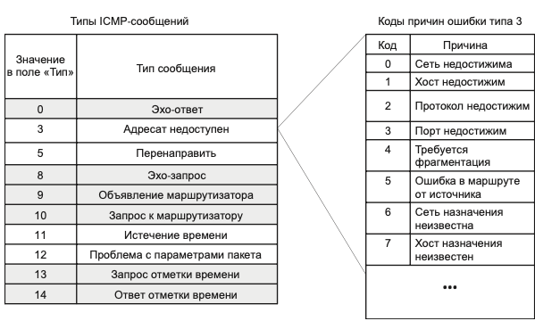

# Экзамен по сетям

---

## Оглавление

- [IP пакет, структура IP пакета](#ip-пакет-структура-ip-пакета)
- [IP маршрутизация, упрощённая таблица маршрутизации, таблица маршрутизации конечного хоста](#ip-маршрутизация-упрощённая-таблица-маршрутизации-таблица-маршрутизации-конечного-хоста)
- [IP маршрутизация: без масок, на основе масок](#ip-маршрутизация-без-масок-на-основе-масок)
- [Схема протоколов модели OSI](#схема-протоколов-модели-osi)
- [Протокол ICMP, структура кадра, типы сообщений, коды ошибок](#протокол-icmp-структура-кадра-типы-сообщений-коды-ошибок)
- [Протоколы TCP/UDP мультиплексировени и демультиплексирование, сокеты](#протоколы-tcpudp-мультиплексировени-и-демультиплексирование-сокеты)
- [Протокол UDP, структура кадра](#протокол-udp-структура-кадра)
- [Протокол TCP, структура кадра, схема логического содеинения в TCP](#протокол-tcp-структура-кадра-схема-логического-содеинения-в-tcp)
- [Протокол TCP, схма состояний](#протокол-tcp-схма-состояний)
- [Классификация протоколов маршрутизации](#классификация-протоколов-маршрутизации)
- [Протокол RIP, время жизни пакетов, зацикливание пакетов](#протокол-rip-время-жизни-пакетов-зацикливание-пакетов)
- [Протокол BGP](#протокол-bgp)
- [Общие принципы построения служб](#общие-принципы-построения-служб)
- [URI, URL, URN](#uri-url-urn)
- [Протокол HTTP, веб-клиент, веб-сервер, заголовки, cookie](#протокол-http-веб-клиент-веб-сервер-заголовки-cookie)
- [Протоколы TLS, SSL](#протоколы-tls-ssl)
- [Протокол FTP](#протокол-ftp)
- [Почтовая служба, протоколы POP и IMAP](#почтовая-служба-протоколы-pop-и-imap)
- [Протокол DNS](#протокол-dns)
- [Протоколы IPv5 и IPv6. Стркуктрура даресов IPv6](#протоколы-ipv5-и-ipv6-стркуктрура-даресов-ipv6)
- [Формат пакета IPv6](#формат-пакета-ipv6)
- [Архитектура безпроводных сетей](#архитектура-безпроводных-сетей)
- [Стек протоколов и стандарты IEEE 802.11](#стек-протоколов-и-стандарты-ieee-80211)
- [Формат кадра в стандарте IEEE 802.11](#формат-кадра-в-стандарте-ieee-80211)
- [Процедура присоединения устройств в IEEE 802.11](#процедура-присоединения-устройств-в-ieee-80211)
- [Работа proxy и NAT](#работа-proxy-и-nat)
- [Фаервол, основные функции, классификация](#фаервол-основные-функции-классификация)
- [Фаервол - схема настройки и фильтрации пакетов](#фаервол---схема-настройки-и-фильтрации-пакетов)
- [Определение и принципы работы WAF, NGFW, UTM](#определение-и-принципы-работы-waf-ngfw-utm)
- [Структура правила snort](#структура-правила-snort)
- [Атака TCP syn flood](#атака-tcp-syn-flood)
- [Атака TCP syn-`ACK` flood](#атака-tcp-syn-`ACK`-flood)
- [Атаки TCP rst\`FIN` flood](#атаки-tcp-rst`FIN`-flood)
- [Атака фраментированный ICMP\UDP flood, атака Ping Of Death](#атака-фраментированный-icmpudp-flood-атака-ping-of-death)
- [Атака ARP-spoo`FIN`g](#атака-arp-spoo`FIN`g)

---

## IP пакет, структура IP пакета

Протокол IP относится к протоколам _без установления соединений_, поддерживая обработку
каждого IP-пакета как независимой единицы обмена, не связанной с другими пакетами.
В протоколе IP нет механизмов, обычно применяемых для обеспечения достоверности
конечных данных. Если во время продвижения пакета происходит какая-либо ошибка, то
протокол IP по своей инициативе ничего не предпринимает для ее исправления. Протокол IP реализует политику доставки «по
возможности».

### Структура IP пакета:

* `Номер версии` занимает 4 бита и идентифицирует версию протокола IP. (IPv4, IPv6)
* `Длина заголовка` занимает 4 бита и и измеряется в 32-битных
  словах. Обычно заголовок имеет длину в 20 байт (пять 32-битных слов), но при добавлении некоторой служебной информации
  это значение может быть увеличено за счет дополнительных байтов в поле параметров. Наибольшая длина заголовка
  составляет 60 байт.
* `Тип сервиса (Type of Service, ToS)` имеет и другое, более современное название —
  `байт дифференцированного обслуживания`, или` DS-байт`. Поле служит для хранения признаков, отражающих требования к
  качеству обслуживания пакета.
    * В прежнем варианте первые три бита содержат значение приоритета пакета: от самого
      низкого — 0 до самого высокого — 7. Маршрутизаторы и компьютеры могут принимать
      во внимание приоритет пакета и обрабатывать более важные пакеты в первую очередь.
    * Следующие три бита поля `ToS` определяют критерий выбора маршрута. Если для бита `D
      (Delay — задержка)` установлено значение 1, то маршрут должен выбираться для минимизации задержки доставки данного
      пакета.
    * Установленный бит `T (Throughput — пропускная
      способность)` — для максимизации пропускной способности
    * Бит `R (Reliability — надежность)` — для максимизации
      надежности доставки. Оставшиеся два бита имеют нулевое
      значение.

    * Стандарты дифференцированного обслуживания, принятые в конце 90-х, дали новое название этому полю, переопределив
      назначение его битов. В `DS-байте` также используются только старшие 6 бит, а два младших бита резервируются.
      `Об этом лучше не упоминать, тк вопроса про DS байты нет в экзамене`
* `Общая длина (2 байта)` - характеризует общую длину пакета с учетом заголовка и поля данных. Максимальная длина пакета
  ограничена разрядностью поля, определяющего эту величину, и составляет 65 535 байт, но в большинстве компьютеров и
  сетей столь большие пакеты не используются. _При передаче по сетям различного типа
  длина пакета выбирается с учетом максимальной длины пакета протокола нижнего уровня, несущего IP-пакеты._ `В стандартах TCP/IP
  предусматривается, что все хосты должны быть готовы принимать пакеты длиной вплоть
  до 576 байт (независимо от того, приходят они целиком или фрагментами).`
* `Идентификатор пакета (2 байта)` - используется для распознавания пакетов,
  образовавшихся путем деления на части (фрагментации) исходного пакета. Все части
  (фрагменты) одного пакета должны иметь одинаковое значение этого поля.
* `Флаги (3 байта)` - содержат признаки, связанные с фрагментацией.
    * `бит DF (Do not Fragment — не фрагментировать)` запрещает маршрутизатору
      фрагментировать данный пакет,
    * `бит MF (More Fragments — больше фрагментов)` говорит о том, что данный пакет является промежуточным (не
      последним)
      фрагментом.
    * Оставшийся бит зарезервирован.
* `Смещения фрагмента (13 бит)` задает смещение в байтах поля данных этого
  фрагмента относительно начала поля данных исходного (нефрагментированного) пакета. `Используется при сборке/разборке
  фрагментов пакетов. Смещение должно быть кратно 8 байтам.`
* `Время жизни (1 байт)` используется для задания
  предельного срока, в течение которого пакет может перемещаться по сети. Время жизни
  пакета измеряется в секундах и задается источником. Поскольку современные
  маршрутизаторы редко обрабатывают пакет дольше, чем за одну секунду, то время жизни
  можно интерпретировать как `максимальное число транзитных узлов`, которые разрешено
  пройти пакету. Если значение поля времени жизни становится нулевым до того, как пакет
  достигает получателя, то пакет уничтожается. `Таким образом, время жизни является своего
  рода часовым механизмом самоуничтожения пакета.`
* `Протокол верхнего уровная(1 байт)` одержит идентификатор, указывающий, какому протоколу верхнего уровня принадлежит
  информация, размещенная
  в поле данных пакета. Например, 6 означает, что
  в пакете находится сообщение протокола TCP, 17 — протокола UDP, 1 — протокола ICMP.

| **Значение** | **Протокол**                                       | **Описание**                                     |
  |--------------|----------------------------------------------------|--------------------------------------------------|
| 0            | Зарезервировано                                    | Используется для специальных целей.              |
| 1            | ICMP (Internet Control Message Protocol)           | Протокол управления сообщениями.                 |
| 2            | IGMP (Internet Group Management Protocol)          | Протокол управления группами.                    |
| 3            | GGP (Gateway-to-Gateway Protocol)                  | Протокол маршрутизации между шлюзами.            |
| 4            | IPv4 (encapsulation)                               | Инкапсуляция IPv4 в IPv4.                        |
| 5            | ST (Stream Protocol)                               | Протокол потоковой передачи.                     |
| 6            | TCP (Transmission Control Protocol)                | Надежный протокол передачи данных.               |
| 8            | EGP (Exterior Gateway Protocol)                    | Протокол внешнего шлюза.                         |
| 9            | IGP (Interior Gateway Protocol)                    | Протокол внутреннего шлюза.                      |
| 17           | UDP (User Datagram Protocol)                       | Ненадежный протокол передачи данных.             |
| 27           | RDP (Reliable Data Protocol)                       | Надежный протокол передачи данных.               |
| 41           | IPv6 (encapsulation)                               | Инкапсуляция IPv6 в IPv4.                        |
| 47           | GRE (Generic Routing Encapsulation)                | Протокол туннелирования.                         |
| 50           | ESP (Encapsulating Security Payload)               | Протокол обеспечения конфиденциальности (IPsec). |
| 51           | AH (Authentication Header)                         | Протокол аутентификации (IPsec).                 |
| 88           | EIGRP (Enhanced Interior Gateway Routing Protocol) | Улучшенный протокол маршрутизации.               |
| 89           | OSPF (Open Shortest Path First)                    | Протокол маршрутизации.                          |
| 115          | L2TP (Layer Two Tunneling Protocol)                | Протокол туннелирования уровня 2.                |
| 132          | SCTP (Stream Control Transmission Protocol)        | Протокол передачи сообщений.                     |
| 255          | Зарезервировано                                    | Для будущего использования.                      |

* `Контрольная сумма заголовка (2 байта)` рассчитывается только по заголовку. Поскольку некоторые поля заголовка меняют
  свое значение в процессе передачи
  пакета по сети (например, поле времени жизни), контрольная сумма проверяется и повторно рассчитывается на каждом
  маршрутизаторе и конечном узле как дополнение к сумме
  всех 16-битных слов заголовка. При вычислении контрольной суммы значение самого поля
  контрольной суммы устанавливается в ноль. Если контрольная сумма неверна, то пакет
  отбрасывается, как только обнаруживается ошибка.
* `Поля IP-адресов источника и приемника имеют одинаковую длину — 32 бита.`
* `Поле параметров является необязательным и используется обычно только при отладке
  сети.` Это поле состоит из нескольких подполей одного из восьми предопределенных типов. В этих подполях можно
  указывать точный маршрут, по которому маршрутизаторы
  должны направлять данный пакет (то есть выполнять `маршрутизацию от источника`),
  регистрировать проходимые пакетом маршрутизаторы или помещать данные системы
  безопасности и временные отметки. Так как число подполей в поле параметров может быть
  произвольным, то в конце заголовка должно быть добавлено несколько нулевых байтов
  для выравнивания заголовка пакета по 32-битной границе.

### Функции IP:

* _Поддержание интерфейса с нижележащими технологиями_ подсетей является одной из важнейших функций протокола IP. В эти
  функции входит
  также _поддержание интерфейса с протоколами вышележащего транспортного уровня_, в частности с протоколом TCP, который
  решает все вопросы обеспечения надежной доставки данных по составной сети в стеке TCP/IP.
* Большая часть действий протокола связана с обработкой той служебной информации, которая переносится в полях заголовка
  пакета.

## IP маршрутизация, упрощённая таблица маршрутизации, таблица маршрутизации конечного хоста

Используя условные обозначения для сетевых адресов маршрутизаторов и номеров сетей,
показанные на рисунке выше, посмотрим, как могла бы выглядеть таблица маршрутизации, например, в маршрутизаторе 4.

| **Адрес назначения** | **Сетевой адрес следующего маршрутизатора** | **Сетевой адрес выходного порта** | **Расстояние до сети назначения** |
|----------------------|---------------------------------------------|-----------------------------------|-----------------------------------|
| N1                   | IP12 (R1)                                   | IP41                              | 1                                 |
| N2                   | –                                           | IP41                              | 0 (подсоединена)                  |
| N3                   | IP12 (R1)                                   | IP41                              | 1                                 |
| N4                   | IP21 (R2)                                   | IP41                              | 1                                 |
| N5                   | –                                           | IP42                              | 0 (подсоединена)                  |
| N6                   | IP21 (R2)                                   | IP21                              | 2                                 |
| IPv                  | IP21 (R2)                                   | IP41                              | 2                                 |
| Маршрут по умолчанию | IP51 (R5)                                   | IP42                              | –                                 |

Первый столбец таблицы содержит адреса назначения пакетов.

В каждой строке таблицы следом за адресом назначения указывается **сетевой адрес следующего маршрутизатора** (точнее,
сетевой адрес интерфейса следующего маршрутизатора),
на который надо направить пакет, чтобы тот передвигался по направлению к заданному
адресу по рациональному маршруту.

Перед тем как передать пакет следующему маршрутизатору, текущий маршрутизатор
должен определить, на какой из нескольких собственных портов (IP41 или IP42) он должен
поместить данный пакет. Для этого служит третий столбец таблицы маршрутизации, содержащий **сетевые адреса выходных
интерфейсов.**

Некоторые реализации сетевых протоколов допускают наличие в таблице маршрутизации
сразу нескольких строк, соответствующих одному и тому же адресу назначения. В этом
случае при выборе маршрута принимается во внимание столбец, представляющий расстояние до сети назначения. При этом
расстояние измеряется в любой метрике, используемой в соответствии с заданным в сетевом пакете критерием. В таблице
расстояние между сетями измеряется хопами. Расстояние для сетей, непосредственно подключенных
к портам маршрутизатора, здесь принимается равным 0, однако в некоторых реализациях
отсчет расстояний начинается с 1.

Когда пакет поступает на маршрутизатор, модуль IP извлекает из его заголовка номер
сети назначения и последовательно сравнивает его с номерами сетей из каждой строки
таблицы. Строка с совпавшим номером сети показывает ближайший маршрутизатор, на
который следует направить пакет. Чаще всего в качестве адреса назначения
в таблице указывается не весь IP-адрес, а только номер сети назначения. Таким образом,
для всех пакетов, направляемых в одну и ту же сеть, протокол IP будет предлагать один
и тот же маршрут.

> Однако в некоторых случаях возникает необходимость для одного из узлов сети определить
> **специфический маршрут**, отличающийся от маршрута, заданного для всех остальных узлов
> сети. Для этого в таблицу маршрутизации помещают для данного узла отдельную строку, содержащую его полный IP-адрес и
> соответствующую маршрутную информацию.

Такого рода запись имеется в таблице для узла В. Предположим, администратор маршрутизатора 4, руководствуясь
соображениями безопасности, решил направить пакеты,
следующие в узел B (полный адрес IPB), через маршрутизатор 2 (интерфейс IP21), а не
маршрутизатор 1 (интерфейс IP12), через который передаются пакеты всем остальным
узлам сети N3. Если в таблице имеются записи о маршрутах как к сети в целом, так и к ее
отдельному узлу, то при поступлении пакета, адресованного данному узлу, маршрутизатор
отдаст предпочтение специфическому маршруту.

Поскольку пакет может быть адресован в любую сеть составной сети, может показаться,
что каждая таблица маршрутизации должна иметь записи обо всех сетях, входящих в составную сеть. Однако при таком подходе
в случае крупной сети объем таблиц маршрутизации может оказаться очень большим, что повлияет на время ее просмотра,
потребует
много места для хранения и т. п. Поэтому на практике широко известен прием уменьшения количества записей в таблице
маршрутизации, основанный на введении маршрута
по умолчанию (default route), учитывающего особенности топологии сети. Рассмотрим,
например, маршрутизаторы, находящиеся на периферии составной сети. В их таблицах
достаточно записать номера только тех сетей, которые непосредственно подсоединены
к данному маршрутизатору или расположены поблизости на тупиковых маршрутах. Обо
всех остальных сетях можно сделать в таблице единственную запись, указывающую на
маршрутизатор, через который пролегает путь ко всем этим сетям. Такой маршрутизатор
называется маршрутизатором по умолчанию (default router). В нашем примере на маршрутизаторе 4 имеются специфические
маршруты только для пакетов, следующих в сети
N1–N6. Для всех остальных пакетов, адресованных в сети N7–N18, маршрутизатор предлагает продолжить путь через один и тот
же порт IP51 маршрутизатора 5, который в данном
случае и является маршрутизатором по умолчанию.

## IP маршрутизация: без масок, на основе масок

Протокол IP извлекает из пакета IP-адрес назначения (предположим, адрес назначения IPB).

1. Выполняется первая фаза просмотра таблицы — поиск специфического маршрута
   к узлу. IP-адрес (целиком) последовательно, строка за строкой, сравнивается с содержимым поля адреса назначения
   таблицы маршрутизации. Если произошло совпадение
   (как в табл. 14.1), то из соответствующей строки извлекаются адрес следующего маршрутизатора (IP21) и идентификатор
   выходного интерфейса (IP41). На этом просмотр
   таблицы заканчивается.
2. Предположим теперь, что в таблице нет строки с адресом назначения IPB, а значит,
   совпадения не произошло. В этом случае протокол IP переходит ко второй фазе просмотра — поиску маршрута к сети
   назначения. Из IP-адреса выделяется номер сети
   (в нашем примере из адреса IPB выделяется номер сети N3), после чего таблица снова
   просматривается на предмет совпадения номера сети в какой-либо строке с номером
   сети из пакета. При совпадении (а в нашем примере оно произошло) из соответствующей строки таблицы извлекаются адрес
   следующего маршрутизатора (IP12) и идентификатор выходного интерфейса (IP41). Просмотр таблицы на этом завершается.
3. Наконец, предположим, что адрес назначения в пакете был таков, что совпадения не
   произошло ни в первой, ни во второй фазах просмотра. В таком случае средствами
   протокола IP либо выбирается маршрут по умолчанию (и пакет направляется по
   адресу IP51), либо, если маршрут по умолчанию отсутствует, пакет отбрасывается.
   Просмотр таблицы на этом заканчивается.

#### ВНИМАНИЕ

> Последовательность фаз в данном алгоритме строго определена, в то время как последовательность
> просмотра или, что одно и то же, порядок расположения строк в таблице, включая запись о маршруте
> по умолчанию, никак не сказывается на результате.

## Схема протоколов модели OSI

## Протокол ICMP, структура кадра, типы сообщений, коды ошибок

> `Протокол межсетевых управляющих сообщений (Internet Control Message Protocol, ICMP)`
> является вспомогательным протоколом, использующимся для диагностики и мониторинга сети.

Протокол ICMP также призван компенсировать ненадежность протокола IP, но несколько
иным образом. Он не предназначен для _исправления_ возникших при передаче пакета проблем: если пакет потерян, то ICMP не
может послать его заново.
> ICMP-пакет является средством оповещения отправителя о «несчастных случаях», произошедших с его
> пакетами.

Пусть, например, протокол IP, работающий на каком-либо маршрутизаторе, обнаружил, что пакет для дальнейшей передачи по
маршруту необходимо фрагментировать,
но в пакете установлен признак DF (не фрагментировать). В таком случае протокол IP,
прежде чем отбросить пакет, отправляет диагностическое ICMP-сообщение конечному
узлу-источнику. ICMP-сообщение передается по сети в поле данных IP-пакета. IP-адрес
узла-источника определяется из заголовка исходного пакета, вызвавшего инцидент.

> Важно, что обработка ICMP-сообщений не входит в обязанности протоколов IP и ICMP.

### Формат, типы и коды ICMP-сообщений

Особенностью протокола ICMP является функциональное разнообразие решаемых задач,
а следовательно, и связанных с этим сообщений. Все типы сообщений имеют один и тот же
формат (рис. 14.14), однако интерпретация полей существенно зависит от того, к какому
типу относится сообщение.

Заголовок ICMP-сообщения состоит из 8 байт:
*тип (1 байт) — числовой идентификатор типа сообщения

* код (1 байт) — числовой идентификатор, более тонко дифференцирующий тип ошибки
* контрольная сумма (2 байта) — подсчитывается для всего ICMP-сообщения.

> Содержимое оставшихся 4 байт в заголовке и поле данных зависит от значений полей типа и кода.

На рис. 14.15 показана таблица основных типов ICMP-сообщений. Эти сообщения можно
разделить на две группы:

* сообщения об ошибках;
* сообщения запрос-ответ (отмечены в таблице темным фоном).

Сообщения типа «запрос-ответ» связаны в пары: «эхо-запрос — эхо-ответ», «запрос маски — ответ маски», «запрос отметки
времени — ответ отметки времени». Важную роль
в работе маршрутизируемой сети играет пара сообщений «запрос маршрутизатора» (router
solicitation) и «объявление маршрутизатора» (router advertisement), которые позволяют
хостам и маршрутизаторам находить друг друга.

Сообщение об ошибках может быть вызвано
различными причинами: неверный адрес сети или конечного узла (код 0 или 1), отсутствие
на конечном узле-адресате необходимого протокола прикладного уровня (код 2 — «протокол недостижим») или открытого порта
UDP/TCP (код 3 — «порт недостижим»). Узел
(или сеть) назначения может быть также недостижим по причине временной неработоспособности аппаратуры или из-за того,
что маршрутизатор не имеет данных о пути к сети
назначения. Всего таблица содержит 15 кодов. Аналогичные таблицы кодов существуют
и для других типов сообщений об ошибках.

## Протоколы TCP/UDP мультиплексировени и демультиплексирование, сокеты

### Мультиплекирование и демультиплексирование приложений

Реализуемая протоколами TCP и UDP процедура распределения между прикладными процессами пакетов, поступающих от сетевого
уровня,
называется `демультиплексированием`.

Существует и обратная задача: данные, генерируемые разными приложениями, работающими на одном конечном узле, должны быть
переданы общему для всех них протокольному модулю IP для последующей отправки в сеть. Эту работу, называемую
`мультиплексированием`, тоже выполняют протоколы
TCP и UDP.

### Сокеты

> Прикладной процесс однозначно определяется в пределах сети и в пределах отдельного компьютера парой (IP-адрес, номер
> порта), называемой сокетом (socket). Сокет, определенный
> IP-адресом и номером UDP-порта, называется UDP-сокетом, а IP-адресом и номером TCP-
> порта — TCP-сокетом.

После получения IP-пакета от протокола
канального уровня протокол IP анализирует содержимое заголовка этого пакета, после
чего заголовок отбрасывается, а «наверх» передается содержимое поля данных IP-пакета,
например UDP-дейтаграмма. Упрощение состоит в том, что вместе с содержимым поля данных на транспортный уровень
передается извлеченный из заголовка IP-адрес назначения,
который и используется для однозначной идентификации приложения.

## Протокол UDP, структура кадра

Протокол UDP, подобно IP, является дейтаграммным протоколом, реализующим так называемый ненадежный сервис `по
возможности`, который не гарантирует доставку сообщений
адресату.

Протокол UDP добавляет к каждому отдельному сообщению свой 8-байтный заголовок, формируя из этих сообщений собственные
протокольные единицы, называемые `UDP-дейтаграммами`, и передает их нижележащему
протоколу IP. В этом и заключаются его функции по _мультиплексированию данных._

### Заголовок UDP состоит из четырех двухбайтных полей:

* номер UDP-порта отправителя;
* номер UDP-порта получателя;
* контрольная сумма;
* длина дейтаграммы.

Функции сводятся к простой передаче данных между прикладным и сетевым уровнями, а также
примитивному контролю искажений в передаваемых данных. При контроле искажений
протокол UDP только _диагностирует, но не исправляет ошибку._ Если контрольная сумма
показывает, что в поле данных UDP-дейтаграммы произошла ошибка, то протокол UDP
просто отбрасывает поврежденную дейтаграмму.

Работая на хосте-получателе, протокол UDP принимает от протокола IP извлеченные
из пакетов UDP-дейтаграммы. Полученные из IP-заголовка IP-адрес назначения и из
UDP-заголовка номер порта используются для формирования UDP-сокета, однозначно
идентифицирующего приложение, которому направлены данные. Протокол UDP освобождает дейтаграмму от UDP-заголовка.
Полученное в результате сообщение он передает
приложению на соответствующий UDP-сокет. Таким образом, протокол UDP выполняет
_демультиплексирование_ на основе сокетов.

## Протокол TCP, структура кадра, схема логического содеинения в TCP

> Протокол TCP предназначен для передачи данных между приложениями. Этот протокол основан
> на логическом соединении, что позволяет ему обеспечивать гарантированную доставку данных,
> используя в качестве инструмента ненадежный дейтаграммный сервис протокола IP.

При работе на хосте-отправителе протокол TCP рассматривает информацию, поступающую к нему от прикладных процессов, как
_неструктурированный_ поток байтов.

Поступающие данные буферизуются средствами TCP. Для передачи на сетевой уровень из
буфера «вырезается» некоторая непрерывная часть данных, которая называется `сегментом`
и снабжается заголовком.

Формат заголовка TCP-сегмента:

### Примечание

> В отличие от протокола UDP, создающего дейтаграммы на основе логически обособленных единиц
> данных (сообщений, генерируемых приложениями), протокол TCP делит поток данных на сегменты
> без учета их смысла или внутренней структуры.

Значение однобитных полей, называемых **флагами**, или **кодовыми
битами** (code bits). Они расположены сразу за резервным полем и содержат служебную
информацию о типе данного сегмента. Положительное значение сигнализируется установкой этих битов в единицу:

* `URG` — срочное сообщение;
* ``ACK`` — квитанция на принятый сегмент;
* `PSH` — запрос на отправку сообщения без ожидания заполнения буфера;
* `RST` — запрос на сброс соединения;
* `SYN` — сообщение, используемое для синхронизации счетчиков переданных данных при установлении соединения;
* ``FIN`` — признак достижения передающей стороной последнего байта в потоке передаваемых данных.

## Протокол TCP, схeма состояний

Соединение устанавливается по инициативе клиентской части приложения. При необходимости выполнить обмен данными с
серверной частью приложение-клиент обращается
к нижележащему протоколу TCP, который в ответ на это обращение посылает сегмент запрос на установление соединения
протоколу TCP, работающему на стороне сервера. В числе прочего в запросе содержится флаг SYN, установленный в 1.

Получив запрос, модуль TCP на стороне сервера пытается создать «инфраструктуру» для обслуживания нового клиента. Он
обращается к ОС с просьбой о выделении
определенных системных ресурсов для организации буферов, таймеров, счетчиков.
Эти ресурсы закрепляются за соединением с момента создания и до момента разрыва.
Если на стороне сервера все необходимые ресурсы были получены и все необходимые
действия выполнены, то модуль TCP посылает клиенту сегмент с флагами ``ACK`` и `SYN`.
В ответ клиент посылает сегмент с флагом ``ACK`` и переходит в состояние установленного логического соединения (
состояние
`ESTABLISHED`). Получив флаг `ACK`, сервер
также переходит в состояние `ESTABLISHED`. На этом процедура установления соединения заканчивается, и стороны могут
переходить к обмену данными. Соединение
может быть разорвано в любой момент по инициативе любой стороны. Для этого клиент
и сервер должны обменяться сегментами `FIN` и `ACK` в последовательности, показанной
на рис. 15.7, б (здесь инициатором является клиент). Соединение считается закрытым
по прошествии некоторого времени, в течение которого сторона-инициатор убеждается,
что ее завершающий сигнал `ACK` дошел нормально и не вызвал никаких «аварийных»
сообщений со стороны сервера.

> Логическое TCP-соединение однозначно идентифицируется парой сокетов, определенных для
> этого соединения двумя взаимодействующими процессами.

Для каждой пары клиент-сервер протоколом TCP создается _отдельное логическое соединение._

> Протокол TCP осуществляет демультиплексирование информации, поступающей на прикладной
> уровень, на основе _соединений процессов_ или, что одно и то же, на основе идентифицирующих
> эти процессы _пар сокетов._

## Классификация протоколов маршрутизации

### Проколы маршрутизации не требующие наличия _таблиц маршрутизации на маршрутизаторах_:

* Метод **Лавинной маршрутизации** заключается в том, что каждый маршрутизатор передает пакет всем своим
  непосредственным
  соседям, исключая тот, от которого его получил.

* **Маршрутизация от источника** (source routing). В этом случае отправитель помещает в пакет информацию о том, какие
  промежуточные маршрутизаторы должны участвовать в передаче пакета к сети назначения. На основе этой информации каждый
  маршрутизатор считывает адрес следующего маршрутизатора, и если он действительно является адресом его
  непосредственного соседа, то передает ему пакет для дальнейшей обработки. Маршрут может задавать либо вручную
  администратор, либо автоматически узел-отправитель, но в этом случае ему нужно поддерживать какой-либо протокол
  маршрутизации, который сообщит ему о топологии и состоянии сети.

### Протоколы маршрутизации требующие наличия таблиц маршрутизации на маршрутизаторах:

Выбор рационального маршрута может осуществляться на основании различных _критериев_. Сегодня в IP-сетях применяются
протоколы маршрутизации, в которых маршрут выбирается по критерию кратчайшего расстояния. При этом расстояние измеряется
в различных метриках. Чаще всего используется простейшая метрика — количество хопов, то есть количество маршрутизаторов,
которые нужно преодолеть пакету
до сети назначения. В качестве метрик применяются также пропускная способность и надежность каналов, вносимые ими
задержки и любые комбинации этих метрик.

Задачей протоколов маршрутизации является создание на всех маршрутизаторах _согласованных_ друг с другом таблиц
маршрутизации, то есть таких таблиц, которые обеспечат
доставку пакета от исходной сети в сеть назначения за конечное число шагов.
Различают протоколы, выполняющие статическую и адаптивную (динамическую) маршрутизацию.

* При **статической маршрутизации** все записи в таблице имеют неизменяемый, статический статус, что подразумевает
  бесконечный срок их жизни. Записи о маршрутах составляются и вводятся в память каждого маршрутизатора _вручную
  администратором сети_. При изменении состояния сети администратору необходимо срочно отразить эти изменения в
  соответствующих таблицах маршрутизации, иначе может произойти их рассогласование и сеть будет работать некорректно.

* При **адаптивной маршрутизации** все изменения конфигурации сети автоматически отражаются в таблицах маршрутизации
  благодаря _протоколам маршрутизации._ Эти протоколы собирают информацию о топологии связей в сети, что позволяет им
  оперативно отражать все текущие изменения. В таблицах маршрутизации при адаптивной маршрутизации обычно имеется
  информация об интервале времени, в течение которого данный маршрут будет оставаться действительным. Это время называют
  _временем жизни_ (TTL) маршрута. Если по истечении времени жизни существование маршрута не подтверждается протоколом
  маршрутизации, то он считается нерабочим, и пакеты по нему больше не посылаются.

### Протоколы адаптивной маршрутизации бывают распределенными и централизованными:

* При распределенном подходе все маршрутизаторы сети находятся в равных условиях, они находят маршруты и строят
  собственные таблицы маршрутизации, работая в тесной кооперации друг с другом, постоянно обмениваясь информацией о
  конфигурации сети.

* При централизованном подходе в сети существует один выделенный маршрутизатор, собирающий всю информацию о топологии и
  состоянии сети от других маршрутизаторов. На основании этих данных выделенный маршрутизатор (иногда называемый
  сервером маршрутов) строит таблицы маршрутизации для остальных маршрутизаторов сети, распространяя их затем по сети,
  чтобы каждый маршрутизатор получил собственную таблицу и в дальнейшем самостоятельно принимал решение о продвижении
  каждого пакета. Централизованный подход порождает более рациональные маршруты потоков, чем распределенный, так как
  решения принимаются на основе полной и непротиворечивой информации о топологии связей сети. Но его недостатком
  является плохая масштабируемость.

Из-за этого недостатка в Интернете доминировали и продолжают доминировать децентрализованные протоколы маршрутизации,
но их решения не всегда дают такие же рациональные маршруты, как решения центрального элемента, так как они основаны
на информации, полученной из третьих рук — от своих соседей, которые в свою очередь получили ее от своих соседей.

Еще одним недостатком распределенных протоколов маршрутизации является существование периодов нестабильной работы сети,
вызванной временной несогласованностью таблиц разных маршрутизаторов. Распределенному протоколу маршрутизации обычно
нужно некоторое время — **время конвергенции**, чтобы после нескольких итераций обмена служебной информацией все
маршрутизаторы сети внесли изменения в свои таблицы, в результате чего они снова стали бы согласованными. Отметим,
различные протоколы маршрутизации обладают разным _временем конвергенции._

> Применяемые сегодня в IP-сетях протоколы маршрутизации относятся к адаптивным распределенным протоколам, которые в
> свою очередь делятся на две группы:
> * дистанционно-векторные алгоритмы (Distance Vector Algorithm, DVA);
> * алгоритмы состояния связей (Link State Algorithm, LSA).

* В `дистанционно-векторных алгоритмах (DVA)` каждый маршрутизатор периодически и широковещательно рассылает по сети
  вектор, компонентами которого являются расстояния (дистанции), измеренные в той или иной метрике, от данного
  маршрутизатора до всех известных ему сетей. Пакеты протоколов маршрутизации обычно называют **объявлениями о
  расстояниях**, так как с их помощью маршрутизатор объявляет остальным маршрутизаторам известные ему сведения о
  конфигурации сети. Получив от некоторого
  соседа вектор расстояний до известных тому сетей, маршрутизатор наращивает компоненты вектора на величину расстояния
  от себя до данного соседа и дополняет вектор информацией об известных ему самому других сетях, о которых он узнал
  непосредственно (если они подключены к его портам) или из аналогичных объявлений других маршрутизаторов. Обновленное
  значение вектора маршрутизатор рассылает своим соседям. В конце концов каждый маршрутизатор получает через соседние
  маршрутизаторы информацию обо всех имеющихся в составной сети сетях и о расстояниях до них и выбирает из нескольких
  альтернативных маршрутов к каждой сети маршрут, обладающий наименьшим значением метрики. Маршрутизатор, передавший
  информацию о данном маршруте, отмечается в таблице маршрутизации как _следующий_ (next hop).

  > Дистанционно-векторные алгоритмы хорошо работают только в небольших сетях. В больших сетях они периодически засоряют
  линии связи интенсивным трафиком, к тому же изменения конфигурации не всегда корректно могут отражаться алгоритмом
  этого типа, так как маршрутизаторы не имеют точного представления о топологии связей в сети, а располагают только
  косвенной информацией — вектором расстояний.

* Алгоритмы состояния связей (LSA) обеспечивают каждый маршрутизатор информацией, достаточной для построения точного
  графа связей сети. Все маршрутизаторы работают на основании одного и того же графа, что делает процесс маршрутизации
  более устойчивым к изменениям конфигурации. Каждый маршрутизатор использует граф сети для нахождения оптимальных по
  некоторому критерию маршрутов до каждой из сетей, входящих в составную сеть. Чтобы понять, в каком состоянии находятся
  линии связи, подключенные к его портам, маршрутизатор периодически обменивается короткими пакетами HELLO со своими
  непосредственными соседями. В отличие от протоколов DVA, которые регулярно передают вектор расстояний, протоколы LSA
  ограничиваются короткими сообщениями, а передача более объемных сообщений происходит только в тех случаях, когда с
  помощью сообщений HELLO был установлен факт изменения состояния какой-либо связи.

  > Cлужебный трафик, создаваемый протоколами LSA, гораздо менее интенсивный, чем у протоколов DVA. Протоколами,
  основанными на алгоритме состояния связей, являются протокол IS-IS стека OSI (этот протокол используется также в стеке
  TCP/IP) и протокол OSPF стека TCP/IP.

## Протокол RIP, время жизни пакетов, зацикливание пакетов

`Протокол маршрутной информации RIP (Routing Information Protocol)` является протоколом маршрутизации
дистанционно-векторного типа и чаще всего используется в небольших сетях. Для IP-сетей имеются две версии RIP — RIPv1 (
не поддерживает маски) и RIPv2(поддерживает маски). Так как способ построения таблиц маршрутизации в обеих версиях
протокола принципиально не отличается.

## Протокол BGP

## Общие принципы построения служб

## URI, URL, URN

## Протокол HTTP, веб-клиент, веб-сервер, заголовки, cookie

## Протоколы TLS, SSL

## Протокол FTP

## Почтовая служба, протоколы POP и IMAP

## Протокол DNS

## Протоколы IPv5 и IPv6. Стркуктрура даресов IPv6

## Формат пакета IPv6

## Архитектура безпроводных сетей

## Стек протоколов и стандарты IEEE 802.11

## Формат кадра в стандарте IEEE 802.11

## Процедура присоединения устройств в IEEE 802.11

## Работа proxy и NAT

## Фаервол, основные функции, классификация

## Фаервол - схема настройки и фильтрации пакетов

## Определение и принципы работы WAF, NGFW, UTM

## Структура правила snort

## Атака TCP syn flood

## Атака TCP syn-ACK flood

## Атаки TCP rst\FIN flood

## Атака фраментированный ICMP\UDP flood, атака Ping Of Death

## Атака ARP-spoo FINg

